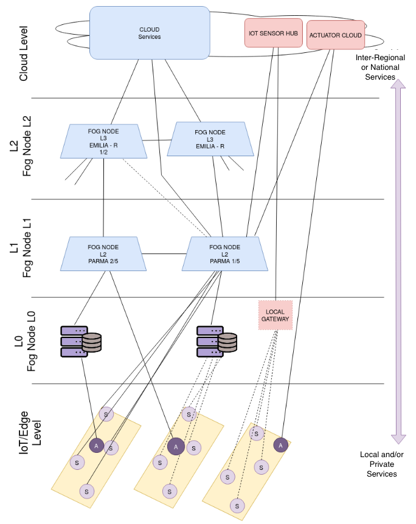

# "Fog Computing in Precision Agricolture" scenario simulation
<div style="text-align: justify">
<details>
<summary>Table of Contents</summary>

- ["Fog Computing in Precision Agricolture" scenario simulation](#fog-computing-in-precision-agricolture-scenario-simulation)
  - [Introduction](#introduction)
  - [Topology and Architecture description](#topology-and-architecture-description)
    - [Architecture and level description](#architecture-and-level-description)
  - [Simulation definition and implementation](#simulation-definition-and-implementation)
    - [Devices Definition](#devices-definition)
      - [YAFS & Python 3](#yafs--python-3)
      - [IoT/Edge level](#iotedge-level)
      - [Fog L0 level](#fog-l0-level)
      - [Fog L1 level](#fog-l1-level)
      - [FOG L2 level](#fog-l2-level)
      - [Cloud level](#cloud-level)
    - [Application Definition](#application-definition)
      - [YAFS & Python 3](#yafs--python-3-1)
      - [Modules definition](#modules-definition)
      - [Messages and Transmissions Definition](#messages-and-transmissions-definition)
    - [Workloads Definition](#workloads-definition)
      - [YAFS & Python3](#yafs--python3)
      - [Workloads and Dynamic Strategies in Precision Agricolture](#workloads-and-dynamic-strategies-in-precision-agricolture)
</details>

## Introduction
The goal of this document is to provide a proof of concept for both a *Fog Computing* architecture for *precision agricolture* and a large-scale network simulation with the fog computing simulator, [YAFS](https://github.com/acsicuib/YAFS).

**NOTE - HOW TO READ** <br>
As you can see from the ToC, in the [Simulation definition and implementation](#simulation-definition-and-implementation) section, each milestone is made of 2 parts. The first one is an explanation of the basic syntax of YAFS, while the second one describes the possible YAFS implementation of the specific study case (the second part can be made of several parts).

## Topology and Architecture description
The reference architecture simulated is shown below:

<div style="text-align: center">



</div>

Precision agricolture has a lot of needs, in this study case reduced to *data production* (from sensors), *data processing* (from Fog Nodes and Cloud) and *communication with actuators* (valve, tractors, etc.).

As shown in the figure above, devices are located into levels, starting from the bottom with nodes that offers none or few services to the network but generates massive amount of data, to the top level with nodes that don't produce data but provide services and computanioal power to the network. In addition, speaking about reachability, the lower the level and the more the node will be reached from limited and circumscribed areas, and also from the physical point of view will be present in the reference territory (guaranteeing low latencies).

### Architecture and level description

 * **IoT/Edge level**<br>
    This level is made of all sensors and actuators that are located into IoT area, having an extremely low computational power, power supply problems, discontinuity in data production and mobility. 
    Devices involved in this level works with low payload protocols, low consumption and hight sleep time. In this level are located Edge nodes, too. The definition of these nodes in the literature varies a lot, in general they can be defined as nodes, to the edge of the network, in which a small elaboration of the data is carried out.
 * **Fog L0 level**<br>
    Here we insert services that do not fall within the IoT level below, but that do not generally offer services to the network (i.e act mostly as a client), but only to private users. They are, for example, farm-level servers that monitor private sensors and/or actuators.
* **Fog L1 level**<br>
    Nodes that provide services and collect and aggregate data from different companies. A possible area of interest is at the provincial or sub-provincial level. These nodes offer several services to the network, for the underlying nodes and for both the overlying ones. For example, for the underlying nodes it deals with data collection, maintenance and historical consultation, communication with actuators, etc. At levels above it offers communication of data (even or only aggregates and anonymous) e.g for data processing.
* **Fog L2 level**<br>
    Nodes dealing with regional or sub-regional geographical areas. They have larger processing capabilities than the underlying level and can therefore also perform heavier tasks such as statistical analysis of aggregated data. They also offer more complex pre-processing at the level above (e.g. distributed ML algorithms).
* **Cloud level**<br>
    Here you will find several services controlled by sensor manufacturers or organizations that interface with sensors and actuators. In addition, there are also services for the management of the application that we try to simulate, which for example deal with training and running very heavy ML algorithms.

## Simulation definition and implementation

In this section device types, message formats and trasmission rate along the network will be defined, taking a look at the Python code, explaining it.

### Devices Definition

#### YAFS & Python 3

Topology (devices and links) can be defined via JSON files. Mandatory attributes are:
* **id**, i.e unique identifier  
* **IPT**, i.e *Instruction per simulation time*. They are the equivalent of IPS (*Instruction Per Second*) but the time unit is defined by the user.
* **RAM**, i.e RAM memory available
  
It's possible to also specify the power consumption with the attributes:
* **WATT**, i.e power consumption
* **POWERmin**, i.e minimum power consumption
* **POWERmax**, i.e maximum power consumption

and specify the position with:
* **coordinate**, that it is divided into:
  * **lat**, i.e latitude
  * **long**, i.e longitude

and it is also possible to specify a generic cost with:
* **COST**, i.e cost per unit time

**Example:**
```json
{
   "id": 120,   // mandatory
   "RAM": 1,    // mandatory
   "IPT": 530,  // mandatory
   "POWERmin": 574,
   "POWERmax": 646,
   "coordinate": 
    {
        "lat": 39.30,
        "long": 3.34
    }
}
```

Speaking about links between nodes, they can be defined via JSON file. Mandatory attributes are:
* **s**, i.e source, its id
* **d**, i.e destination, its id
* **BW**, i.e link bandwidth
* **PR**, i.e link propagation speed

The *latency* is dynamically computed using:
```math
\frac{Message.size.bytes}{BW}+PR$$
```
**Example:**
```json
{
    "s": 0,
    "d": 1,
    "BW": 2,
    "PR": 10
}
```
Since it's everything written in Python, user can define the topology hardcoding node and link as follows:
```python
from yafs.topology import Topology

topology_json = {}
topology_json["entity"] = []
topology_json["link"] = []

cloud_dev    = {"id": 0, "model": "cloud","mytag":"cloud", "IPT": 5000 * 10 ^ 6, "RAM": 40000,"COST": 3,"WATT":20.0}
sensor_dev   = {"id": 1, "model": "sensor-device", "IPT": 100* 10 ^ 6, "RAM": 4000,"COST": 3,"WATT":40.0}
actuator_dev = {"id": 2, "model": "actuator-device", "IPT": 100 * 10 ^ 6, "RAM": 4000,"COST": 3, "WATT": 40.0}

link1 = {"s": 0, "d": 1, "BW": 1, "PR": 10}
link2 = {"s": 0, "d": 2, "BW": 1, "PR": 1}

topology_json["entity"].append(cloud_dev)
topology_json["entity"].append(sensor_dev)
topology_json["entity"].append(actuator_dev)
topology_json["link"].append(link1)
topology_json["link"].append(link2)

t = Topology()
t.load(topology_json)
```
```topology_json``` can be a JSON file, too.

For both nodes and links, user can define custom tags, for his specific purposes.
#### IoT/Edge level

Devices involved into this level are sensors and actuators. 

As said before those devices have a low energy consumption: for semplicity we can assume that power consumption is about from 5 mW to 100 mW. This devices also have a low RAM memory, we can assume that it is about from 64 MB to 128 MB.

Sensors and actuators can be defined as follows:
```json
{
    "id": n,
    "IPT": 1000,
    "RAM": 0.064,
    "POWERmin": 0.005,
    "POWERmax": 0.1
}
```

#### Fog L0 level

This level hosts node that act as private servers. They can be, for example, Raspberry PIs, having a 1800 IPT, 4 GB RAM and a power consumption of 3.4 W. 

L0 level devices are defined as follows:
```json
{
    "id": n,
    "IPT": 2000*10^6, // Arm raspberry cpu
    "RAM": 4,
    "WATT": 3.4
}
```

#### Fog L1 level

From this level on, nodes becomes more powerful. In this level several *city-level nodes* can be deployed, with 16 GB of RAM and  with a power consumption ranging from 250 W to 550 W:

```json
{
    "id": n,
    "IPT": 80000*10^6, // Intel i7
    "RAM": 16,
    "POWERmin": 250,
    "POWERmax": 550
}
```

#### FOG L2 level

Here can be deployed several *regional-level nodes* with 64 GB of RAM and a power consumption ranging from 750 W to 950 W.

```json
{
    "id": n,
    "IPT": 150000*10^6, // average low level server cpu
    "RAM": 64,
    "POWERmin": 750,
    "POWERmax": 950
}
```

#### Cloud level

The computational power for this level it's set to be extremely high. Values specified are fictitious:

```json
{
    "id": n,
    "IPT": 10^20,
    "RAM": 1024,
    "WATT": 10^5
}
```

### Application Definition

#### YAFS & Python 3

YAFS supports the deployment of multiples applications based on DAG (*Directed Acyclic Graph*). Apps can be defined both via Python API or using a JSON-based syntax.

Application are made of three parts:
* **Modules (Services):** Modules ddefine services of an App. A module can create messages (a pure source / sensor), a modul can consume messages (a pure sink / actuator ) and other modules can do both tasks. Mandatory attributes are the ```id``` and the ```name```. YAFS does not allow to specify a complexity for modules, insted it's possible to For example:
    ```json
    "module": 
    [
        {
            "id": 0,
            "name": "data_sender"
        },
        {
            "id": 1,
            "name": "data_receiver",
            "type": "CLOUD"
        }
    ]
    ```
    ```type``` is a user defined attribute.
* **Messages:** Messages are the requests among services. Mandatory attributes are: 
  * ```id```
  * ```name``` 
  * ```s```: source module
  * ```d```: destination module
  * ```bytes```: message length in bytes
  * ```ìnstructions```: the higher this value, the slowest gets processed, also depending on the IPT of the node hosting the destination service.

  If the message arrive a pure sink this message does not require the last two attributes. In YAFS, it is also possible to define broadcast messages.

    **Example:** 
    ```json
    "message ": 
    [
        {
            "d": "S0", 
            "bytes": 2770205 , 
            "name": "M.USER.APP1", 
            "s": "None", 
            "id": 0, 
            "instructions": 0
        },
        {
            "d": "S0", 
            "bytes": 2770205 , 
            "name ": "M0_0", 
            "s": "S0", 
            "id": 1, 
            "instructions": 20
        },
        {
            "bytes": 22, 
            "name ": "M0-1", 
            "s": "S0", 
            "id": 2, 
            "instructions": 0,
        }
    ]
    ```

* **Transmissions:** represents how the services *process* the requests and generates other requests. ```fractional``` is the probability to propagate the input message. It is important to note that the probability is linked to forwarding, not to individual messages.
    
    **Example:**
    ```json
    "transmissions": 
    [
        {
            "module": "SO",
            "message_in": "M.USER.APP1"
        },
        {
            "message_out": "M0_0",
            "message_in": "M.USER.APP1",
            "module": "SO",
            "fractional": 0.5
        }
    ]
    ```

Since it's everything written in Python, user can define the application hardcoding modules, messages and transmission as follows

```python
import random
from yafs.application import Application
from yafs.application import Message

def create_application():
    # APLICATION
    a = Application(name="SimpleCase")

    # (S) --> (ServiceA) --> (A)
    a.set_modules([{"Sensor":{"Type":Application.TYPE_SOURCE}},
                   {"ServiceA": {"RAM": 10, "Type": Application.TYPE_MODULE}},
                   {"Actuator": {"Type": Application.TYPE_SINK}}
                   ])
    
    # Messages among MODULES (AppEdge in iFogSim)
    m_a = Message("M.A", "Sensor", "ServiceA", instructions=20*10^6, bytes=1000)
    m_b = Message("M.B", "ServiceA", "Actuator", instructions=30*10^6, bytes=500)


    # Defining which messages will be dynamically generated # the generation is controlled #by Population algorithm
    a.add_source_messages(m_a)

    # MODULES/SERVICES: Definition of Generators and Consumers (AppEdges and TupleMappings #in iFogSim)
    # MODULE SERVICES
    a.add_service_module("ServiceA", m_a, m_b, fractional_selectivity, threshold=1.0)

    return a

app1 = create_aplication("Tutorial1")
```

#### Modules definition

This app works thanks to several services (application's modules), located into the different levels:
* **IoT/Edge Level**: In this level we distinguish two modules:
  * ```sensor_data_sender```, whose purpose is to send the massive amount of data to the upper levels. It's located into sensors.
  * ```actuator_command_receiver```, whose purpose is to receive command from the upper nodes
* **Fog L0-L2 Levels**: In Fog Computing there's a problem called "Service Allocation", meaning that more than one node can host more than one service along with problem related. Indeed the latters can change, go ON/OFF or moved from one node to another. 
  * ```l0_service_1```, ```l0_service_2```, ```l0_service_n``` whose purpose it's to elaborate data and eventually forward messages to the upper levels.
  * ```l1_service_1```, ```l1_service_2```, ```l1_service_n``` and ```l2_service_1```, ```l2_service_2```, ```l2_service_n``` whose purpose it's to elaborate data and eventually forward messages to the upper levels. In this layers services also offer computational power both for upper and lower levels.
* **Cloud Level** 
  * ```cloud_service```, whose purpose it's to elaborate data. Cloud can also work as a source sending requests to lower level for example for distributed computing.

JSON definition of modules is omitted due its semplicity and similarity to what is written above.

#### Messages and Transmissions Definition

As said before YAFS needs all the modules interaction to be defined through the definition of messages. 

As you can see from the picture above, communications are not limited to "touching" levels but lower levels can communicate wtih every other, with lower probability depending on both logical and physical distance.

The json-based syntax is not fully defined, so the API is still necessary to define some functionalities such as broadcasting. To implement the desired functionality YAFS provide an API, that is defined as follows:
```python

def add_service_module(self, 
                        module_name, # The module name
                        message_in,  # The input message
                        message_out="", # Any outgoing message
                        distribution="", # Distribution Function
                        module_dest=[], # BROADCAST destination modules
                        p=[], # BROADCAST probability for each destination module
                        **param)
```

For messages not involved into broadcasting, the transmission can be defined via the JSON-syntax shown above or thanks to the API.

A message starting from the IoT can travel to the L0 level with a 30% probability, then can be forwarded to the L1 level with a 30% probability, then to the L2 with 20% and finally to the Cluoud with a 20% probability.

Messages generated from L0, L1, L2 and Cloud are more and more heavier, implying more computational power and elaboration time.

### Workloads Definition

#### YAFS & Python3

To define initial workloads, i.e the initial messages generated from the app, in YAFS called the *population*, the simplest way is to use a JSON-based syntax.

**Example:**
```json
{
    "sources": 
    [
        {
            "id_resource": 20,
            "app": 0,
            "message": "sample_message_0",
            "lambda": 229
        }.
        {
            "id_resource": 33,
            "app": 1,
            "message": "sample_message_1",
            "lambda": 223
        }
    ]
}
```

In the example above you can see an attribute called ```lambda```. YAFS can implement dynamic events into the scenario, such as the generation of messages in a dynamic way. The classes involved into dynamic policies, have two main interfaces: an *initialization function* that prepares allocation of modules and workloads on topology entities and a function invoked according to a customized temporal distribution. The ```lambda``` attribute is the *lambda* parameter of the *exponential distribution* for the initialization funciton. At this time (Apr 2021) YAFS only supports this type of distribution in the JSON-based syntax. Other distribution can be found and used with the APIs in ```yafs/distribution.py```. A complete implementation of what it's explained above can be found in ```examples/MCDA/main.py```. In the code the population is implemented as follows:
```python
"""
POPULATION algorithm
"""
dataPopulation = json.load(open('population_definition.json'))
population = JSONPopulation(name="statical", json=dataPopulation)
```

Next we have to define the service allocation, hence the placement of services in the nodes. The service allocation is managed by the Placement class. The placement can be defined using JSON-based syntax or API functions. 

**Syntax Example:**

```json
{
    "initialAllocation": 
    [
        {
            "module_name": "SO",
            "app": "0",
            "id_resource": 153
        },
        {
            "module_name": "S1",
            "app": 0,
            "id_resource": 153
        }
    ]
}
```

In the code:
```python
 placementJson = json.load(open(path + 'allocDefinition%s.json' % case)) 
 placement = JSONPlacement(name="Placement", json=placementJson)
```

Next we need to define the message routing algorithms and the orchestration protocols. The aim of this section is to answer the following question:
* What route does take a message to reach a service? (*Routing problem*)
* Where is the service deployed? (*Discovery problem*)
* How many services of the same type are deployed? (*Scalability issues*)
* What happen if a network link fail? Whad happen if a service is unavailable in the moment that the message achieves the node where the service is deployed? (*Failure management*)

YAFS developers provided a lot of example (still written in Py 2) that provide an overview for several scenarios. In general what we need to define is a *Selector Path*, that defines how nodes have to deal with routing and all the problem listed above. The selector path can be both defined by the user and come from the NetworkX library.

In the code (example):
```python
from yafs.path_routing import DeviceSpeedAwareRouting

selector_path = DeviceSpeedAwareRouting()
```

This routing and orchestration algorithm are a heavy computational task with huge networks, so it is possible to also implement a caching system for self written routing algorithm.

**DEPLOYING THE APPS**

All the variables declared in the sections above, have to be combined to deploy the app(s). 

Assuming that more than one app have to be deployed:
```python
#For each deployment the user - population have to contain only its specific sources 
for app in apps.keys():
    s.deploy_app(apps[app], placement, selector_path)
```
whith ```s``` being the DES (Simulation) object.

#### Workloads and Dynamic Strategies in Precision Agricolture

Placement and all the operation that are iterable for an extremely high number of nodes can be done with python cycles, using the YAFS python api mixed to JSON-defined components.

As said above, services in the network can vary their status (ON/OFF) and YAFS, which is based on the Simpy DES library, allows to implement it with the use of the *CustomStrategy* class.

CustomStrategy class is defined as follows:
```python
class CustomStrategy():
    def __init__(self, pathResults):
        ...
    
    def __call__(self, sim, routing, case, stop_time, it):
        self.activation += 1
        ...
```
CustomStrategy can be used as follow:
```python
dStart = deterministicDistributionStartPoint(stop_time/2.0,
                                             stop_time / 2.0 /10.0, 
                                             name="Deterministic")
evol = CustomStrategy(pathResults)
s.deploy_monitor("EvolutionOfServices", 
                 evol, 
                 dStart, 
                 **{"sim": s, "routing": selectorPath,"case":case, "stop_time":stop_time, "it":it})    
```
When defined like this, the code in ```__call__``` will be triggered in each step of the deterministic distribution specified.

