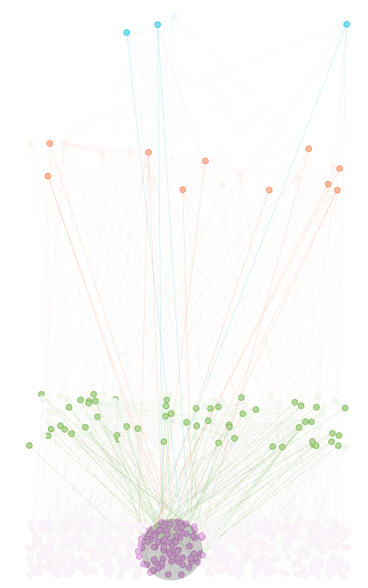
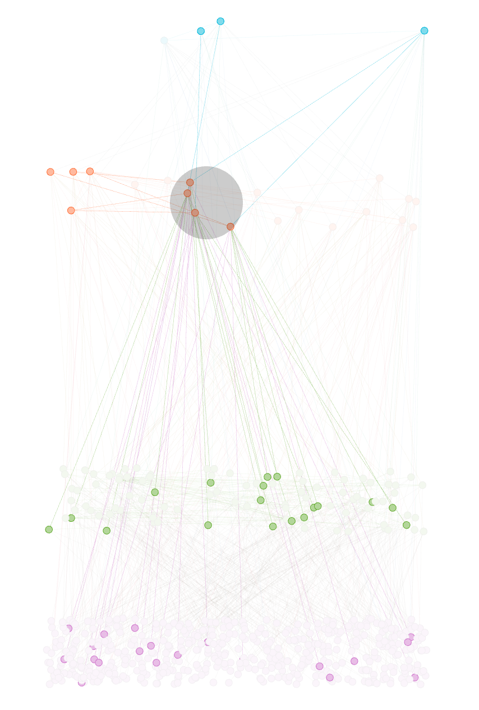

<div style="text-align: justify">

# Topology Generator

The class ```TopologyGenerator``` is a tool for generating layared networks (```networkx``` graphs) for simulating Fog Computing realistic scenarios.

## How to use and how it works

### How to use
To generate a graph the ```generate_topology``` method is required:
```python
generate_topology(iot_nodes, levels, k)
```
Where:
- ```iot_nodes``` is the amount of IoT-level nodes (sensors and actuators). There isn't the need to specify the amount of nodes for the upper levels since they are computed from the amount of IoT nodes. (see ```k``` below).
 - ```levels``` is the amount of levels for the layered topology.
 - Every new level has ```1/k``` (in this case ```1/3```) of the previous level's amount of nodes.

**Example**
```python
from TopologyGenerator import TopologyGenerator

G = TopologyGenerator.generate_topology(500, 4, 3)
```
 
 ### How it works

Nodes in their belonging level (exluding the IoT level) are interconnected using a power law distribution, following the *scale-free network* model (<a href="https://en.wikipedia.org/wiki/Scale-free_network">Wikipedia</a>). In particular in this generator is used the ```barabasi_albert_graph``` method from ```networkx```. This method returns a random graph according to the Barabási–Albert (<a href="https://en.wikipedia.org/wiki/Barab%C3%A1si%E2%80%93Albert_model">Wikipedia</a>) preferential attachment model: a graph of ```n``` nodes is grown by attaching new nodes each with ```m``` (in this case ```m = 1```) edges that are preferentially attached to existing nodes with high degree.

The nodes in the iot layer are not connected to each other, since it is rare that sensors and attuctors are connected.

The 20% of the nodes in level ```i``` have a 80% chance to be connected to a random node belonging to the level ```i + 1```. Nodes that not satisfy this percentage have a 80% chance to be connected to a random node in the level ```i + 2```, and so on. (80% and 20% percentages follow the <a href="https://en.wikipedia.org/wiki/Pareto_principle">Pareto Principle</a>).

## Demonstrations

IoT nodes can be connected to nodes of non-touching levels, with a low chance:<br>


Nodes in intermediate levels can be connected to both upper and lower levels, assuming that they can provide services to both:<br>

